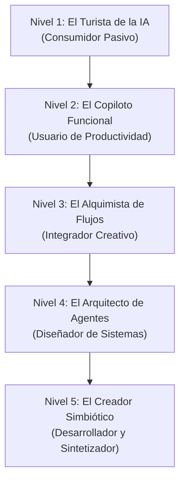

# Modelo de Madurez de Uso Personal de Inteligencia Artificial (MM-UPIA)

Este modelo conceptual está diseñado para evaluar y guiar el progreso de un individuo en su relación, adopción y dominio de las tecnologías de Inteligencia Artificial (IA). A diferencia de los modelos organizacionales (Gartner, Deloitte, etc.), este se enfoca en el desarrollo de capacidades cognitivas, técnicas y actitudinales a nivel individual.

---

## Estructura General del Modelo

El modelo consta de 5 niveles progresivos:

---

## Detalle de los Niveles de Madurez

### Nivel 1: El Turista de la IA (Consumidor Pasivo)
*La fase de exploración inicial, donde la IA es vista como una novedad o un buscador avanzado.*

* **Conductas Observables:**
  * Realiza preguntas simples de una sola interacción (single-turn prompts).
  * Utiliza la IA de manera esporádica, principalmente para buscar información o entretenimiento.
  * Acepta las primeras respuestas que genera la herramienta sin cuestionar el sesgo o la alucinación.
  * Utiliza configuraciones predeterminadas; no personaliza la interacción.
* **Herramientas Típicas:**
  * Versiones gratuitas de chatbots masivos (ChatGPT Free, Gemini Free, Microsoft Copilot en modo básico).
  * Herramientas de traducción directa (DeepL, Google Translate).
* **Mentalidad / Actitud:**
  * **Escepticismo o fascinación superficial.** Ve a la IA como un "juguete" inteligente, un oráculo o una calculadora de texto. Existe cierto temor o distancia tecnológica.
* **Metáfora Visual:**
  * **El Visitante de Museo:** Camina por las salas (interfaces), observa lo que hay, hace un par de preguntas al guía (bot) y se retira sin interactuar profundamente con la obra ni modificar su entorno.

---

### Nivel 2: El Copiloto Funcional (Usuario de Productividad)
*La IA se integra en las tareas diarias como una herramienta de apoyo operativo para aumentar la eficiencia.*

* **Conductas Observables:**
  * Redacta prompts estructurados (ej: asigna un rol como *"Actúa como un corrector de estilo..."*).
  * Utiliza la IA para resumir textos largos, traducir con contexto, generar ideas iniciales (brainstorming) y estructurar correos o informes.
  * Comienza a iterar sobre la respuesta (multi-turn prompting) para refinar el resultado.
  * Aplica criterio humano para corregir errores obvios de la IA.
* **Herramientas Típicas:**
  * ChatGPT Plus, Gemini Advanced, Claude Pro (modelos de lenguaje avanzados de pago).
  * Asistentes de redacción y productividad integrados (Microsoft 365 Copilot, Google Workspace AI, Grammarly, Notion AI).
* **Mentalidad / Actitud:**
  * **Pragmatismo utilitario.** "La IA es mi asistente rápido". Su foco es el ahorro de tiempo y la automatización de microtareas manuales de escritura o lectura.
* **Metáfora Visual:**
  * **El Conductor con GPS:** El usuario decide el destino y maneja el vehículo, pero confía en el GPS (IA) para que le sugiera la ruta más eficiente, recalculando si es necesario, aunque mantiene el control del volante.

---

### Nivel 3: El Alquimista de Flujos (Integrador Creativo)
*El usuario no solo usa la IA para tareas sueltas, sino que diseña flujos de trabajo donde combina herramientas e introduce datos complejos.*

* **Conductas Observables:**
  * Crea y utiliza instrucciones personalizadas (Custom Instructions) o perfiles específicos (GPTs personalizados, Gems en Gemini, Proyectos en Claude).
  * Sube grandes volúmenes de datos propios (PDFs, hojas de cálculo) para realizar análisis avanzados y extraer patrones complejos.
  * Combina múltiples herramientas de IA (ej: genera un guion con LLM, voz con ElevenLabs e imagen con Midjourney).
  * Aplica técnicas de prompting más sofisticadas (Chain of Thought, Few-Shot prompting).
* **Herramientas Típicas:**
  * GPTs personalizados, Claude Projects, NotebookLM de Google.
  * Generadores de imágenes y multimedia avanzada (Midjourney, DALL-E 3, Canva AI, ElevenLabs).
  * Extensiones de IA para hojas de cálculo (GPT for Sheets).
* **Mentalidad / Actitud:**
  * **Colaboración activa y experimentación.** Ve a la IA como un socio de pensamiento (sparring partner) con el que co-crea y del cual recibe retroalimentación crítica.
* **Metáfora Visual:**
  * **El Director de Orquesta de Cámara:** Dirige a un grupo selecto de músicos (herramientas de IA y plantillas personalizadas) para que interpreten una partitura compleja diseñada por él, asegurando la armonía del resultado final.

---

### Nivel 4: El Arquitecto de Agentes (Diseñador de Sistemas)
*El individuo diseña y automatiza sistemas complejos donde múltiples componentes de IA interactúan de forma autónoma o semi-autónoma.*

* **Conductas Observables:**
  * Conecta la IA con APIs externas o bases de datos propias mediante integraciones sin código (no-code/low-code) o scripts sencillos.
  * Diseña flujos de trabajo automatizados que se disparan ante ciertos eventos (ej: cuando llega un correo, un agente analiza el tono, redacta una respuesta y otro agente busca datos en una base de datos).
  * Domina el prompting programático y el manejo de variables dentro de flujos de IA.
  * Usa herramientas de desarrollo basadas en IA para escribir y depurar código de forma acelerada.
* **Herramientas Típicas:**
  * Plataformas de automatización con IA (Make.com, Zapier AI, Dify, Flowise).
  * IDEs de desarrollo asistido por IA avanzada (Cursor, Windsurf, GitHub Copilot).
  * Acceso directo a APIs de proveedores (OpenAI API, Anthropic Console).
* **Mentalidad / Actitud:**
  * **Pensamiento sistémico y apalancamiento.** Su enfoque es: "No quiero hacer el trabajo con IA; quiero diseñar el sistema que haga el trabajo por mí". Busca la delegación cognitiva estructurada.
* **Metáfora Visual:**
  * **El Ingeniero de Fábrica Automatizada:** Ya no ensambla las piezas a mano (escribiendo prompts uno a uno); diseña la línea de ensamblaje (flujos e integraciones) donde robots (agentes de IA) procesan la información de principio a fin.

---

### Nivel 5: El Creador Simbiótico (Desarrollador y Sintetizador)
*El nivel más alto de madurez personal. El individuo modifica los modelos, crea tecnologías encima de ellos o integra la IA como una extensión directa de su capacidad cognitiva diaria.*

* **Conductas Observables:**
  * Realiza ajustes finos (Fine-Tuning) de modelos abiertos para tareas muy específicas.
  * Implementa y ejecuta modelos de lenguaje locales (SLMs o LLMs locales) por razones de privacidad, costo o personalización extrema.
  * Desarrolla aplicaciones de software completas donde la IA es el núcleo (Core AI apps).
  * Domina arquitecturas RAG (Retrieval-Augmented Generation) avanzadas desde el código.
  * Contribuye al ecosistema open-source de IA.
* **Herramientas Típicas:**
  * Entornos de ejecución local (Ollama, LM Studio).
  * Repositorios y librerías de desarrollo (Hugging Face, PyTorch, LlamaIndex, LangChain).
  * Servicios de computación en la nube para entrenamiento o inferencia (RunPod, AWS, Google Cloud).
* **Mentalidad / Actitud:**
  * **Co-evolución y control absoluto.** La IA no es una herramienta externa; es una infraestructura cognitiva personalizable y moldeable. Cree en la soberanía tecnológica individual.
* **Metáfora Visual:**
  * **El Diseñador del Ecosistema:** No solo pilota la nave ni diseña la fábrica; crea las leyes físicas, moldea la materia prima (entrena/ajusta modelos) y define los límites del espacio donde operan los agentes y los humanos.

---

## Test de Autodiagnóstico

Instrucciones para el usuario: *Lee las siguientes preguntas por cada sección. Selecciona la opción que mejor describa tu realidad actual para identificar en qué nivel te encuentras.*

### Autodiagnóstico - Nivel 1: El Turista de la IA
1. **¿Con qué frecuencia utilizas herramientas de IA como ChatGPT o Gemini?**
   * a) Rara vez (menos de una vez al mes) o nunca.
   * b) Un par de veces por semana, principalmente para buscar datos curiosos o divertirme.
   * c) Todos los días para mis actividades principales.
2. **Cuando obtienes una respuesta de la IA que parece incorrecta o incompleta, ¿qué haces habitualmente?**
   * a) Abandono la herramienta y busco la información en Google.
   * b) Intento cambiar un poco la pregunta, pero si sigue fallando, me rindo.
   * c) Utilizo técnicas de reformulación para guiar a la IA hasta la respuesta correcta.
3. **¿Cuál de las siguientes situaciones describe mejor tu conocimiento sobre cómo funciona un chat de IA?**
   * a) No entiendo bien cómo funciona; me parece una especie de buscador mágico.
   * b) Sé que predice palabras, pero me limito a escribirle preguntas como si fuera un humano.
   * c) Entiendo conceptos de tokens, ventanas de contexto y limitaciones de entrenamiento.
4. **¿Cuántas aplicaciones o pestañas de IA tienes configuradas o guardadas para uso recurrente?**
   * a) Ninguna; solo entro a la web de ChatGPT cuando me la recomiendan.
   * b) Una o dos, pero uso siempre la versión gratuita y sin modificar nada.
   * c) Varias, incluyendo versiones de pago o herramientas especializadas en mi campo.

### Autodiagnóstico - Nivel 2: El Copiloto Funcional
1. **Al escribirle a una IA, ¿con qué frecuencia le asignas un rol, contexto o formato específico en tu mensaje inicial?**
   * a) Casi nunca; voy directo a la pregunta (ej: "Haz un resumen de esto").
   * b) A veces, cuando me acuerdo de que mejora la calidad de la respuesta.
   * c) Siempre; tengo una estructura clara de prompt (Rol + Contexto + Tarea + Restricciones).
2. **¿En qué medida la IA forma parte del proceso de redacción de tus correos, informes o trabajos escritos?**
   * a) No la uso para eso.
   * b) La uso frecuentemente para corregir ortografía, redactar borradores rápidos o resumir textos que me envían.
   * c) Tengo flujos automatizados que redactan y analizan mis textos con mi tono de voz preestablecido.
3. **¿Cómo validas la veracidad de la información compleja entregada por una IA?**
   * a) Confío en lo que me dice la herramienta por defecto.
   * b) Reviso manualmente los puntos críticos o le pido a la misma IA que me dé fuentes para verificar en la web.
   * c) Sé exactamente cuándo un modelo es propenso a "alucinar" y cruzo sus datos con fuentes académicas o bases de datos confiables de inmediato.
4. **¿Qué herramientas de IA de pago o asistentes integrados (ej. Copilot en Word/Gmail, Claude Pro) utilizas de forma activa en tu rutina de trabajo?**
   * a) Ninguno; uso exclusivamente herramientas gratuitas.
   * b) Uso al menos una herramienta avanzada (gratuita o de pago) integrada en mi suite de productividad (Word, Notion, etc.).
   * c) Uso múltiples suscripciones y herramientas avanzadas para optimizar mi flujo de trabajo.

### Autodiagnóstico - Nivel 3: El Alquimista de Flujos
1. **¿Has creado o configurado alguna vez una versión personalizada de un GPT, un "Gem" o un "Proyecto" en Claude para que tenga tu información o instrucciones fijas?**
   * a) No sabía que se podía hacer eso.
   * b) He usado algunos creados por otras personas, pero no he diseñado uno propio.
   * c) Sí, he creado varios adaptados a tareas específicas de mi docencia, investigación o trabajo.
2. **¿Con qué frecuencia subes archivos de datos (ej: bases de datos en Excel, reportes PDF largos) para pedirle a la IA análisis estadísticos o resúmenes complejos?**
   * a) Nunca; solo interactúo mediante texto escrito por mí.
   * b) Ocasionalmente, para que me resuma un PDF largo o me explique un concepto de un artículo científico.
   * c) Regularmente; utilizo la IA para analizar tablas de datos, encontrar patrones o contrastar múltiples documentos a la vez.
3. **Cuando realizas un proyecto creativo (presentación, video, reporte), ¿cómo coordinas las herramientas de IA?**
   * a) Uso una sola IA para que me ayude a estructurar las ideas.
   * b) Genero el texto en una IA y luego manualmente busco imágenes o diseño las diapositivas de forma tradicional.
   * c) Diseño una secuencia: extraigo los datos con un LLM, estructuro las diapositivas, utilizo IA para generar las imágenes acordes al tono y automatizo el formateo del contenido.
4. **¿Qué tan familiarizado estás con técnicas de prompting como "Few-Shot" (dar ejemplos al modelo) o "Chain of Thought" (pedirle que piense paso a paso)?**
   * a) No conozco esos términos.
   * b) Los he escuchado o aplicado intuitivamente, pero no los uso de manera sistemática.
   * c) Los aplico de forma consciente y deliberada para programar el comportamiento del modelo en tareas complejas.

### Autodiagnóstico - Nivel 4: El Arquitecto de Agentes
1. **¿Has conectado alguna herramienta de IA con otra aplicación (como Slack, Notion, Gmail o Google Sheets) a través de herramientas de automatización como Make, Zapier o APIs?**
   * a) No, me parece técnicamente muy complejo.
   * b) Lo he intentado o he visto tutoriales, pero no tengo un flujo operativo activo.
   * c) Sí, tengo automatizaciones activas donde la IA interactúa de forma autónoma con mis otras herramientas de trabajo.
2. **¿Con qué frecuencia utilizas la IA para que escriba, corrija o complete código de programación para automatizar tus propias tareas informáticas?**
   * a) Nunca programo ni uso código en mi vida diaria.
   * b) A veces le pido fórmulas avanzadas de Excel o pequeños scripts de HTML/Python para cosas puntuales.
   * c) Uso herramientas de desarrollo asistidas por IA (ej: Cursor) a diario para construir herramientas internas o scripts de automatización.
3. **¿Cuál de las siguientes situaciones define mejor tu relación con los "agentes autónomos" de IA?**
   * a) No sé qué es un agente de IA.
   * b) Entiendo que pueden actuar solos, pero no he configurado ni interactuado con un sistema multi-agente.
   * c) He configurado plataformas (como Dify o Make) donde un agente realiza una tarea y le pasa el resultado a otro agente de forma automática.
4. **Al resolver un problema de automatización de datos, tu primer instinto es:**
   * a) Buscar a un especialista técnico o hacerlo manualmente.
   * b) Preguntarle a ChatGPT cómo podría resolverlo paso a paso de forma manual.
   * c) Diseñar mentalmente un flujo de trabajo que conecte la API de un modelo de IA con mi fuente de datos para automatizarlo.

### Autodiagnóstico - Nivel 5: El Creador Simbiótico
1. **¿Has descargado y ejecutado alguna vez un modelo de lenguaje de código abierto de manera local (sin conexión a internet, usando los recursos de tu propia computadora)?**
   * a) No, no sabía que era posible o no sé cómo hacerlo.
   * b) Conozco herramientas como Ollama, pero no las uso de forma regular para mi trabajo.
   * c) Sí, ejecuto modelos locales habitualmente por privacidad, desarrollo o experimentación.
2. **¿Has realizado el proceso de "Fine-Tuning" (ajuste fino) de un modelo de IA con un conjunto de datos propio para especializarlo en tu área?**
   * a) No, me parece un concepto fuera de mi alcance.
   * b) Entiendo el concepto técnico, pero no lo he implementado a nivel práctico.
   * c) Sí, he entrenado o ajustado modelos (o LoRAs de imágenes/texto) para adaptarlos exactamente a mis necesidades.
3. **Cuando necesitas una aplicación de software específica para tu flujo de trabajo:**
   * a) Busco si existe una app comercial y me adapto a ella.
   * b) Le pido a un LLM que me ayude a buscar alternativas o a usar soluciones ya existentes.
   * c) Construyo mi propia aplicación web o de escritorio integrando librerías de IA (como LangChain o API de OpenAI) adaptada a mis necesidades específicas.
4. **¿Cuál es tu nivel de contribución al ecosistema global de IA?**
   * a) Ninguno; soy solo un usuario final.
   * b) Comparto prompts, GPTs públicos o participo en foros de discusión de usuarios de IA.
   * c) Comparto código en GitHub, contribuyo a proyectos open-source de IA, publico modelos/datasets en Hugging Face o publico investigaciones sobre el área.

---

## Interpretación del Autodiagnóstico

Para determinar el nivel de madurez personal en IA:

1. **Predominancia de Respuestas (c):** Si en un nivel obtienes **3 o más respuestas "c"**, dominas plenamente ese nivel y puedes considerarte posicionado en él o en transición al siguiente.
2. **Distribución Progresiva:** Una persona suele tener un perfil escalonado. Por ejemplo:
   * Respuestas mayoritariamente **"c"** en el Nivel 1 y Nivel 2.
   * Respuestas mezcladas en el Nivel 3.
   * Respuestas mayoritariamente **"a"** o **"b"** en los Niveles 4 y 5.
   * *Diagnóstico:* Esta persona es un **Copiloto Funcional avanzado** en transición a **Alquimista de Flujos**.
